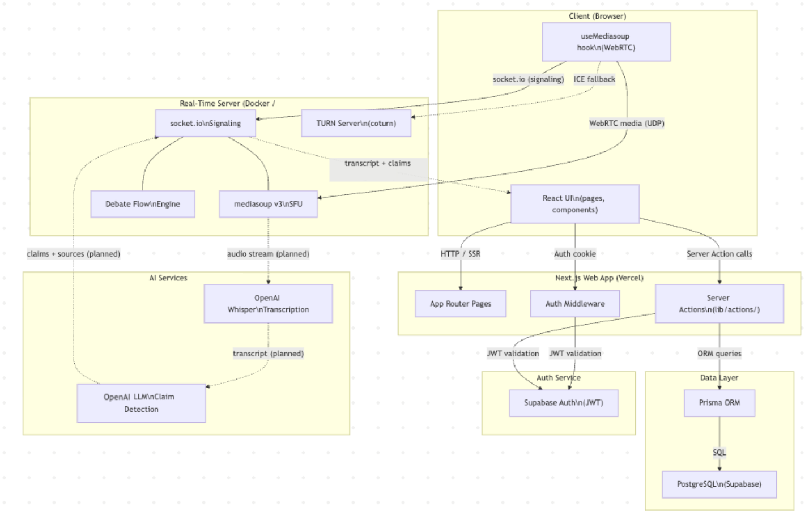
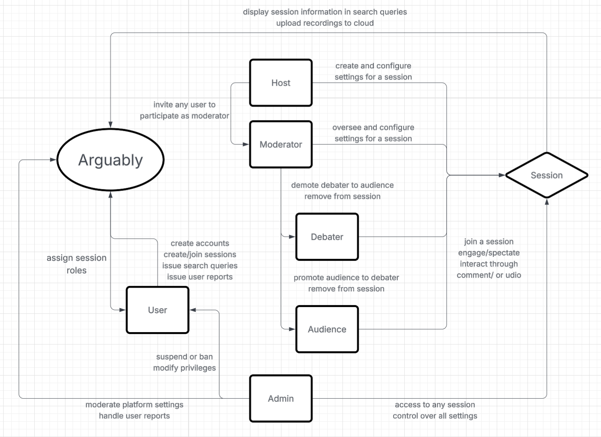
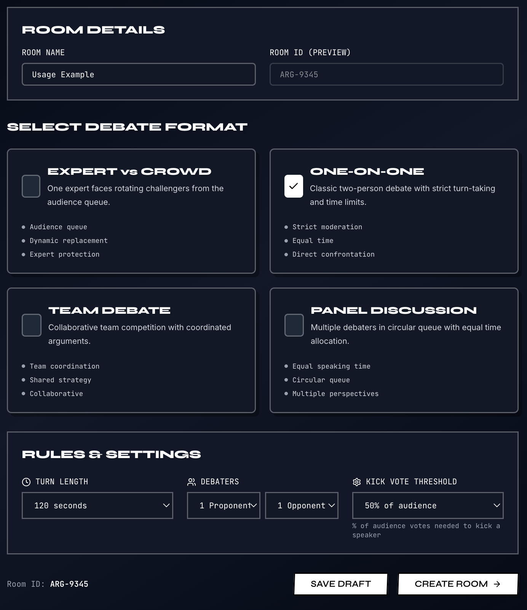
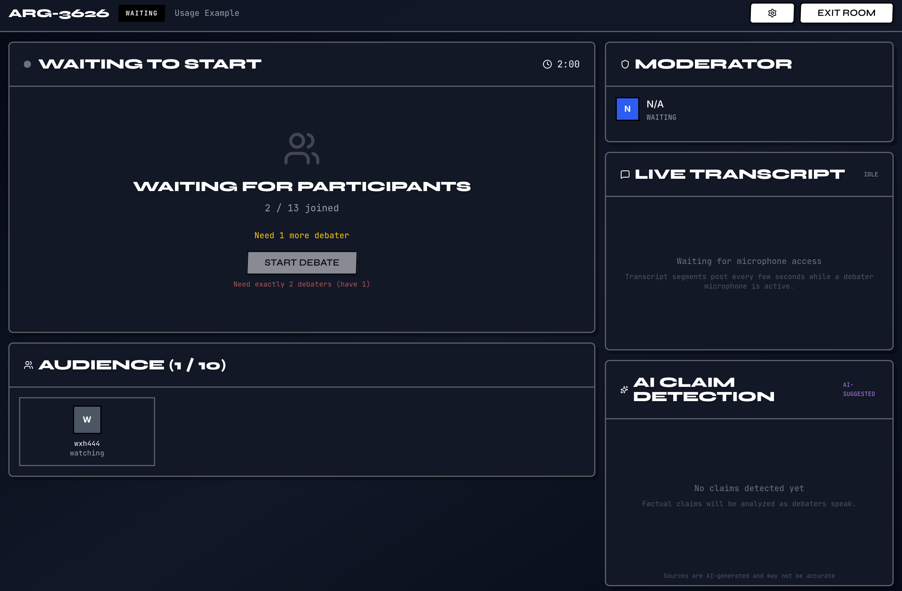
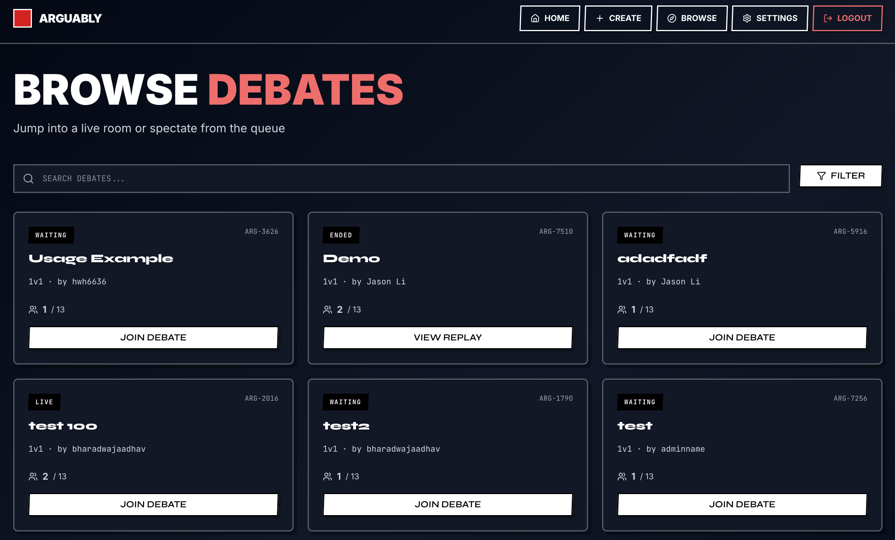
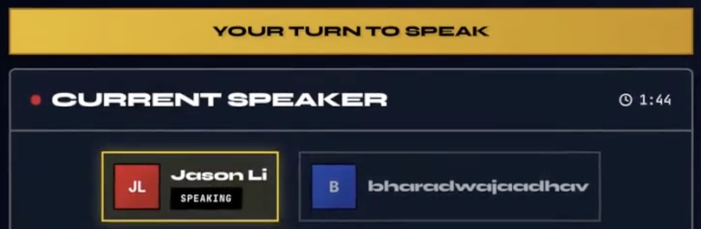
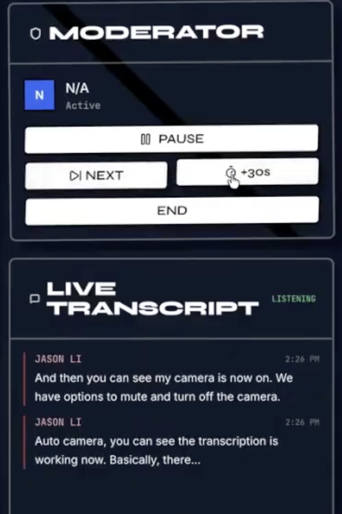
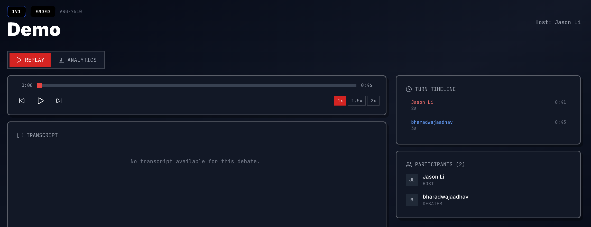
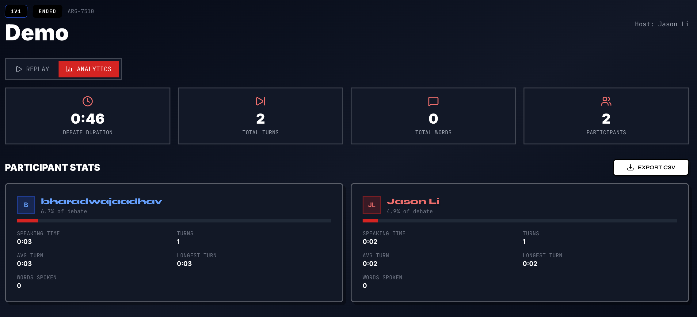

**Live URL: [Arguably](https://arguably.vercel.app/)**

# Project Description

**Arguably** is an online debate platform where designed specifically to structure, moderate, 
and enhance live debates in a variety of formats. Unlike generic video-conferencing tools, 
Arguably is purpose-built for debate dynamics such as timed turns, audience voting, moderation 
controls, and real-time feedback.

# Architecture Overview

Arguably is structured as a three-tier web application with a separate real-time media server. Rather than a monolith, the system is divided into five major subsystems that communicate through well-defined interfaces: the Next.js Web Application, the Supabase Authentication Service, the PostgreSQL Persistent Database, the Real-Time Server, and AI Services. This separation reflects distinct operational concerns: persistent data management, stateless HTTP serving, and stateful long-lived media connections all have fundamentally different hosting and scaling requirements, and mixing them would constrain each.  The user only needs to interact with the Real-Time Server and the Next.js Web App, while the rest of the subsystems are encapsulated in the background.





# Tech Stacks & Dependencies

We used **TypeScript** as our primary programming language to ensure type safety and improve development efficiency through compile-time checks. For our full-stack framework, we used **Next.js**, which is built on top of React and provides features such as file-based routing, server-side rendering, and API routes for backend functionality.

We used **PostgreSQL** as our database system because our data model relies on structured relationships between entities. **Supabase** provides a managed PostgreSQL database along with built-in authentication and security features. **Prisma ORM** acts as the interface between our TypeScript application and the database, enabling type-safe queries and schema management.

We used **OpenAI** for speech transcription and real-time fact-checking during live debate sessions. **Socket.IO** handles signaling and real-time event communication, coordinating client-server interactions and changes in session state. **Mediasoup**, built on WebRTC, is responsible for low-latency audio and video streaming between participants.

# Setup Steps

The fastest way to try Arguably is the live deployment: https://arguably.vercel.app/.

To run locally, you need **Node.js 20+**, **npm**, and a **Supabase project** (free tier works) for auth and the PostgreSQL database. Live transcription and claim detection additionally require **OpenAI** and **Gemini** API keys.

### 1. Clone and install

```bash
git clone https://github.com/jasonli2446/arguably.git
cd arguably
npm install            # postinstall runs `prisma generate` automatically
npm install --prefix realtime
```

### 2. Configure environment variables

Copy `.env.example` to `.env` in the project root and fill in the values:

```bash
cp .env.example .env
```

| Variable | Required | Notes |
|----------|----------|-------|
| `DATABASE_URL` | yes | Supabase Postgres connection string (port 5432) |
| `NEXT_PUBLIC_SUPABASE_URL` | yes | Supabase project URL |
| `NEXT_PUBLIC_SUPABASE_ANON_KEY` | yes | Supabase anon key |
| `NEXT_PUBLIC_SFU_URL` | yes | URL of the realtime SFU (e.g. `http://localhost:3001` for local dev) |
| `OPENAI_API_KEY` | optional | Required only for live transcription |
| `GEMINI_API_KEY` | optional | Required only for AI claim detection |
| `TEST_USER_EMAIL` / `TEST_USER_PASSWORD` | optional | Used by Playwright E2E tests; the user must exist in Supabase Auth |

Then copy `realtime/.env.example` to `realtime/.env` and set at minimum `ANNOUNCED_IP=127.0.0.1` and `LISTEN_PORT=3001` for local development.

### 3. Push the database schema

```bash
npx prisma db push     # creates all tables in your Supabase Postgres
```

### 4. Start the realtime server (separate process)

The WebRTC SFU runs as a standalone Node.js process. From the project root:

```bash
npm run realtime:dev   # starts mediasoup + Socket.IO on port 3001
```

Alternatively, run it in Docker (includes a TURN server for NAT traversal):

```bash
npm run realtime:docker:up
```

### 5. Start the Next.js web app

In a separate terminal:

```bash
npm run dev            # http://localhost:3000
```

Open [http://localhost:3000](http://localhost:3000), sign up, then create or join a room. Video, audio, and turn-taking will only work while the realtime server from step 4 is running.

# Usage Example

Any registered user can create a room with a preferred debate format and customized settings.



After creating a room, the user becomes the host, and can wait for other to join before starting the debate.



If the user just wants to join a room, the browse page is available with all the rooms created by other users.



During a live session, the automated turn taking engine will be active and present informative visual cues.  The speaker can always manually enable or disable the camera or the microphone.



During a live session, the host (or an assigned moderator) can control the debate flow with options such as timing extensions and turn skipping.  Additionally, the transcription engine enabled by OpenAI will follow the debate flow and transcribe what every speaker has to say. 



After a session ends, the user can check the replay of that session, with analytics available for review.





# Repository Folder Structure Overview

With the App Router structure of Next.js, the `app` directory serves as the core of the application. It defines all routes, layouts, and server/client components.  It additionally includes backend API route handlers when needed.  Static assets such as images and icons are stored in the `public` directory, which allows them to be served directly by the application.

Frontend logic is organized into separate directories for clarity and reuse. The `components` directory contains reusable UI elements, while `hooks` stores custom React hooks for shared stateful logic. Common utilities and shared modules, such as database clients or helper functions, are placed in the `lib` directory to keep the codebase modular and maintainable.

For the backend and data layer, the `prisma` directory contains the database schema and migration files managed by Prisma ORM. Real-time communication logic is separated into the `realtime` directory, which handles signaling and media coordination using technologies such as Socket.IO and mediasoup.

The `docs` and `images` directories are solely for documentation purposes.  The `node_modules` directory stores installed dependencies and is automatically generated.

There are two directories for software testing: `__tests__` stores all the unit tests for program logics, while `tests` stores all the end-to-end tests for real-time program flow with results stored in `playwright-report` folder.  For more information, consult `testing.md` in the root directory.

# Team Members & Contributions

* Jason Li - Backend and frontend, integration, deployment
* Aadhav Bharadwaj - WebSFU, backend, integration, deployment
* Praveen Sureshkumar - Frontend, AI transcription
* WenHao Huang - Database, backend, documentation

# Challenges and Lessons

The project presented challenges across frontend development, deployment, real-time systems, and evolving system design.

On the frontend side, UI styling and state management proved to be difficult. AI-assisted tools were used, and required careful prompting to achieve desirable results after multiple iterations. Issues with inconsistent UI updates and state changes occasionally caused components not to render or update properly, requiring debugging support from tools like Claude.

Deployment introduced additional complexity, particularly on Vercel. Styling inconsistencies due to caching, along with misconfigured environment variables and API keys, caused discrepancies between local and production environments. These issues required debugging of build behavior and cache invalidation.

For real-time features, integrating WebRTC via mediasoup proved challenging. Early issues included unreliable video session initialization and WebSocket disconnections, as well as bugs related to state management that prevented video streams from loading correctly. These were eventually resolved through iterative debugging and AI-assisted troubleshooting.

AI-powered transcription worked reliably in local development but failed during a live demo due to runtime transcription errors, highlighting the gap between controlled and production environments.

On the backend, designing the database schema was difficult due to evolving requirements, particularly around supporting multiple debate formats. Frequent schema changes introduced complexity, which was mitigated by adopting more flexible designs such as nullable fields.

## License

This project is licensed under the MIT License.

The MIT License is a permissive open-source license that allows anyone to use, modify, distribute, and sublicense this software, provided that the original copyright notice and license text are included in all copies or substantial portions of the software.

For more details, consult `LICENSE.md` in the root directory.
